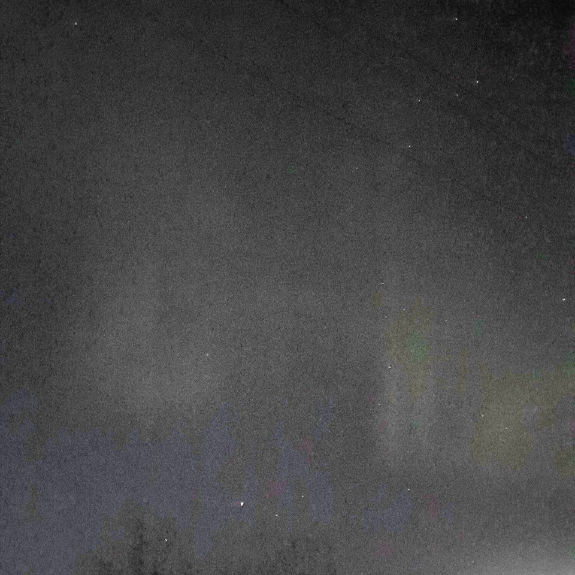
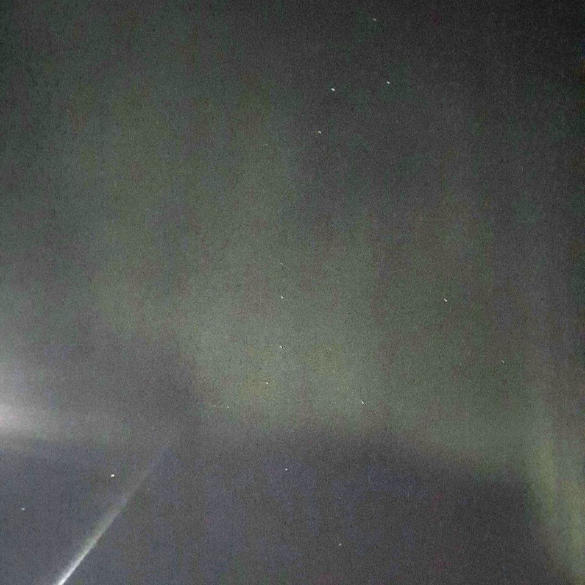
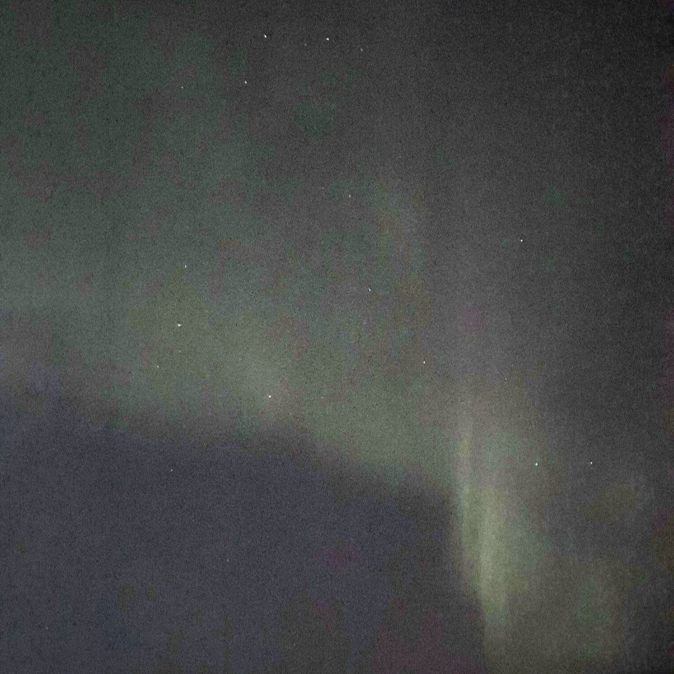

# Northern Lights

* **ID:** NS-P003
* **Date:** 22.12.25

## How the Phenomenon Occurs

The **aurora borealis** begins far beyond Earth's atmosphere — with activity on the Sun. The solar wind and eruptions of solar plasma carry charged particles into near-Earth space.

Earth's magnetic field directs some of these particles along magnetic field lines toward the polar regions.

As the particles enter the upper atmosphere, they collide with atoms and molecules of oxygen and nitrogen. During these collisions, they transfer energy to the atoms and molecules, placing them in an excited state.

When these atoms and molecules return to a lower-energy state, they release photons — producing visible light.

Different gases and altitudes of emission produce different colors. This is why the aurora can appear in **green, red, blue, and violet** shades.

The shape of the aurora is constantly changing because the flow of charged particles and the structure of Earth's magnetic field are continuously changing.

© NESTIMS
